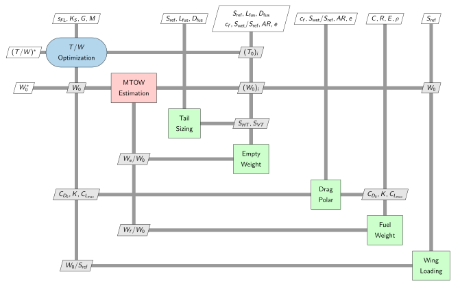

# MECH 3620 Materials

This repository consists of some materials used for MECH 3620 - Aircraft Design at The Hong Kong University of Science and Technology.

## Guide

To install the **customised** pyXDSM library (https://github.com/mdolab/pyXDSM) using Python, navigate to this repository's [pyXDSM](pyXDSM) folder from your terminal and run `pip install .` (or `pip3 install .` for Python 3 on some operating systems), which will overwrite any previous installation of pyXDSM.

## Usage

For an example of generating XDSMs, check [scripts](scripts).

